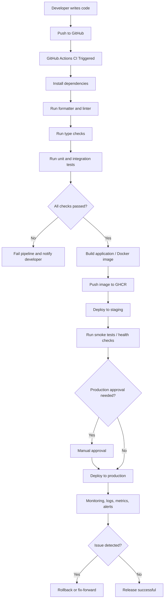

# CI/CD Explained

## What is CI/CD?

**CI/CD** stands for:

- **CI** = **Continuous Integration**
- **CD** = **Continuous Delivery** or **Continuous Deployment**

It is a software engineering practice used to **build, test, validate, package, and release code automatically** whenever developers push changes.

Instead of manually running tests, manually building applications, and manually deploying to servers, CI/CD automates the entire path from **code commit** to **running application**.

---

## Why CI/CD is needed

In a real project, many developers may push code every day. Without CI/CD, teams face problems such as:

- code breaking after merge
- tests being forgotten
- inconsistent build process
- deployment mistakes
- slow release cycles
- difficult rollback and debugging

CI/CD solves this by making software release:

- faster
- repeatable
- safer
- more reliable
- more observable

---

## CI: Continuous Integration

Continuous Integration means that whenever a developer pushes code to GitHub:

1. the source code is pulled by an automation pipeline
2. dependencies are installed
3. code quality checks are run
4. tests are executed
5. build artifacts may be created

The goal of CI is to detect problems **early**.

### Typical CI steps

- checkout code
- setup runtime (Python, Java, Go, Node.js, etc.)
- install dependencies
- run formatter check
- run linter
- run type checker
- run unit tests
- run integration tests
- generate coverage report
- build Docker image or package

### Example in Python

For a Python application, CI may run:

- `ruff` for linting
- `mypy` for type checking
- `pytest` for tests
- Docker build to confirm packaging works

If any step fails, the pipeline fails and developers know immediately.

---

## CD: Continuous Delivery / Continuous Deployment

After CI succeeds, the next stage is CD.

### Continuous Delivery

Code is automatically prepared for release, but a human usually approves production deployment.

Example:

- code passes CI
- Docker image is built
- image is pushed to registry such as **GHCR**
- deployment package is ready
- release manager clicks approval for production

### Continuous Deployment

Code is automatically deployed to production without manual approval after all checks pass.

Example:

- tests pass
- security scans pass
- Docker image is built
- image is pushed to GHCR
- Kubernetes deployment is updated automatically
- new version becomes live

---

## Difference between CI, Continuous Delivery, and Continuous Deployment

| Term | Meaning | Manual Step? |
|---|---|---|
| Continuous Integration | Automatically build and test every code change | No |
| Continuous Delivery | Automatically prepare release, but deploy to production with approval | Yes |
| Continuous Deployment | Automatically deploy to production after pipeline success | No |

---

## End-to-end CI/CD flow

A typical flow looks like this:

1. Developer writes code
2. Code is pushed to GitHub
3. GitHub Actions starts pipeline
4. Linting and tests run
5. Build is created
6. Docker image is generated
7. Image is pushed to container registry (for example GHCR)
8. Deployment happens to staging or production
9. Monitoring checks application health
10. If something fails, rollback may happen

---

## CI/CD Flow Diagram



---

## Practical explanation of each stage

## 1. Source Control

This is where developers keep code, usually in:

- GitHub
- GitLab
- Bitbucket

Every change is tracked through commits, branches, pull requests, and tags.

---

## 2. Build Stage

The build stage converts source code into a runnable artifact.

Examples:

- Python: wheel, package, or Docker image
- Java: JAR/WAR
- Node.js: production bundle
- Go: binary

Even in Python, where code is interpreted, build stage is still useful for packaging and containerization.

---

## 3. Static Code Checks

This stage improves code quality before runtime.

Examples:

- linting
- formatting validation
- type checking
- secret scanning
- dependency vulnerability scanning

For Python:

- `ruff` → linting and style
- `black` → formatting
- `mypy` → type checking
- `bandit` → security scanning
- `pip-audit` → vulnerable dependencies

---

## 4. Testing Stage

Testing ensures that the application behaves as expected.

Common test types:

- unit tests
- integration tests
- API tests
- contract tests
- smoke tests
- end-to-end tests
- performance tests

CI usually runs the faster tests first. Heavier tests may run later in staging.

---

## 5. Artifact or Image Creation

After checks pass, a deployable artifact is produced.

Examples:

- `.jar`
- `.whl`
- `.tar.gz`
- Docker image

In container-based systems, the most common artifact is a **Docker image**.

Example:

- build image from Dockerfile
- tag it using commit SHA, branch, or release tag
- push to registry such as **GHCR**, Docker Hub, or ECR

---

## 6. Registry

A registry stores built artifacts or container images.

Examples:

- **GHCR** (GitHub Container Registry)
- Docker Hub
- Amazon ECR
- Google Artifact Registry
- Azure Container Registry

For GitHub projects, GHCR is a common choice because it integrates well with GitHub Actions.

Example image name:

```text
ghcr.io/jitenpalaparthi/python-ci-cd-app:latest
```

---

## 7. Deployment Stage

Deployment means moving the validated build into an environment.

Common environments:

- local
- development
- QA
- staging
- production

Deployment targets may include:

- VM/server
- Docker Compose host
- Kubernetes cluster
- serverless platform
- PaaS platforms like Render or Railway

---

## 8. Verification After Deployment

After deployment, teams usually run checks like:

- health endpoint test
- smoke test
- readiness check
- synthetic transactions
- log verification

This ensures that the app is not just deployed, but actually working.

---

## 9. Monitoring and Rollback

A good CI/CD setup does not stop at deployment.

It should also connect to:

- logs
- metrics
- traces
- alerts
- dashboards

If errors increase after deployment, the system may:

- rollback to previous version
- stop rollout
- alert engineers
- create incident ticket

---

## Real-world GitHub Actions CI/CD example

Suppose you have a Python FastAPI application.

### CI pipeline on pull request

When developer creates a PR:

- checkout repository
- setup Python
- install dependencies
- run `ruff`
- run `mypy`
- run `pytest`
- optionally build Docker image

If all pass, PR is considered technically safe to merge.

### CD pipeline on main branch

When code is merged to `main`:

- checkout repository
- build Docker image
- login to GHCR
- push image to GHCR
- deploy to server or Kubernetes
- run smoke tests
- notify Slack/Teams

---

## Benefits of CI/CD

### 1. Faster releases

Teams can release many times per day instead of once per month.

### 2. Early bug detection

Errors are found soon after code is committed.

### 3. Consistency

Every deployment follows the same automated process.

### 4. Less manual error

Humans do not have to remember dozens of deployment steps.

### 5. Better collaboration

Developers get fast feedback and confidence during pull requests.

### 6. Easier rollback

Because each build is versioned, restoring a previous working version is simpler.

---

## Risks of bad CI/CD design

If designed poorly, CI/CD can also cause issues:

- slow pipelines
- flaky tests
- secrets exposed in logs
- deploying untested code
- weak branch protections
- no rollback strategy
- no environment separation

So a production-grade pipeline should include:

- branch protection
- required status checks
- test coverage
- secret management
- image signing if needed
- vulnerability scanning
- staging validation
- observability
- rollback plan

---

## Common tools used in CI/CD

### Source Control

- GitHub
- GitLab
- Bitbucket

### CI/CD Engines

- GitHub Actions
- GitLab CI
- Jenkins
- CircleCI
- Azure DevOps
- Argo Workflows
- Tekton

### Build Tools

- Docker
- BuildKit
- Maven
- Gradle
- npm
- poetry
- pip

### Testing

- pytest
- JUnit
- Postman/Newman
- Cypress
- Playwright

### Security

- Bandit
- pip-audit
- Trivy
- Snyk
- Dependabot

### Deployment

- Docker Compose
- Kubernetes
- Helm
- Argo CD
- Flux
- Terraform
- Ansible

### Observability

- Prometheus
- Grafana
- Loki
- Tempo
- OpenTelemetry

---

## CI/CD in simple language

You can think of CI/CD like this:

- **CI** checks whether your code is good
- **CD** moves that good code safely to users

A simple analogy:

- Developer writes exam paper = writes code
- Teacher checks grammar and answers = linter and tests
- School prints final copy = build artifact
- School sends it to branches = deployment
- Principal checks if everything is fine = monitoring and approval

---

## Short example scenario

A developer fixes a bug in a Python API.

1. They push code to GitHub
2. GitHub Actions starts CI
3. `ruff`, `mypy`, and `pytest` run
4. All checks pass
5. Docker image is built
6. Image is pushed to GHCR
7. Staging deployment happens
8. Smoke tests pass
9. Production deployment happens
10. Grafana dashboards confirm no error spike

That is a practical CI/CD cycle.

---

## Summary

CI/CD is an automation pipeline that helps software teams:

- integrate code continuously
- test automatically
- build reliable artifacts
- deploy safely
- monitor releases properly

It is one of the most important foundations of modern DevOps and production-grade software delivery.

---

## One-line definition

**CI/CD is the automated path that takes code from developer commit to validated production release with quality checks, packaging, deployment, and monitoring.**
