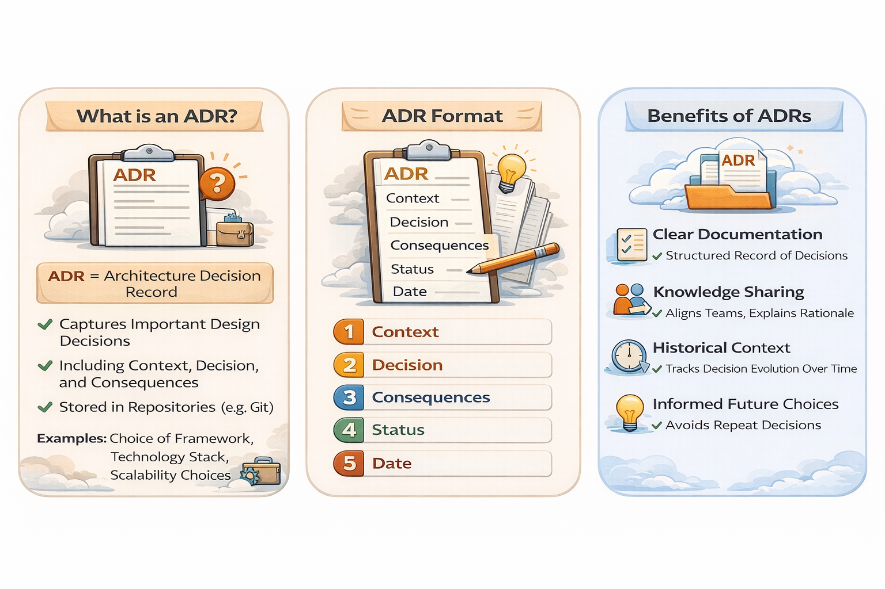
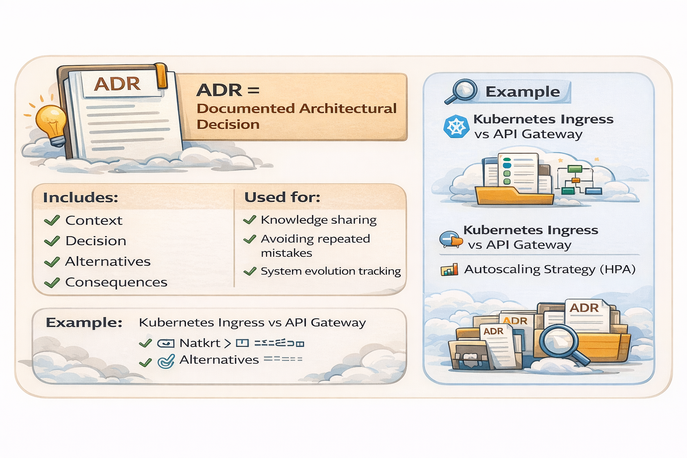

# 📘 Architecture Decision Records (ADR) – Complete Guide

---

## 🖼️ ADR Overview

---

<strong>🔹 What is an ADR?</strong>

### Definition
ADR (Architecture Decision Record) is a **document that captures important architectural decisions** along with their context and consequences.

### Why ADR?
- Avoid tribal knowledge
- Maintain decision history
- Improve team alignment

### Key Idea
> Every important decision should be **documented, justified, and traceable**

---

<strong>🔹 ADR Structure</strong>

### Standard Format

1. **Context**
2. **Decision**
3. **Alternatives**
4. **Consequences**
5. **Status**
6. **Date**

---

### Explanation

#### Context
- Problem statement
- Constraints (scale, latency, cost)

#### Decision
- Final chosen approach

#### Alternatives
- Other options considered

#### Consequences
- Trade-offs, risks, benefits

#### Status
- Proposed / Accepted / Deprecated

#### Date
- Decision timestamp

---

<strong>🔹 Benefits of ADR</strong>

- 📄 Clear documentation
- 👥 Knowledge sharing
- 🕒 Historical tracking
- 🔁 Avoid repeated mistakes
- 📈 Better system evolution

---

# 🧩 Real ADR Examples

---

<strong>📌 ADR-001: Kubernetes Ingress vs API Gateway</strong>

### Context
Need external access to microservices deployed in Kubernetes.

### Decision
Use **API Gateway (e.g., Kong / AWS API Gateway)** instead of basic Ingress.

### Alternatives
- Kubernetes Ingress (NGINX)
- Service Mesh (Istio Gateway)

### Consequences

**Pros:**
- Centralized auth, rate limiting
- Better observability

**Cons:**
- Extra cost
- Added latency

### Status
Accepted

### Date
2026-04-13

---

<strong>📌 ADR-002: Database Choice (PostgreSQL vs NoSQL)</strong>

### Context
System requires strong consistency for financial transactions.

### Decision
Use **PostgreSQL (RDBMS)**

### Alternatives
- MongoDB
- Cassandra

### Consequences

**Pros:**
- ACID compliance
- Strong consistency

**Cons:**
- Harder horizontal scaling

### Status
Accepted

---

<strong>📌 ADR-003: Synchronous vs Asynchronous Communication</strong>

### Context
Services experiencing latency spikes due to blocking calls.

### Decision
Adopt **event-driven architecture (Kafka)**

### Alternatives
- REST synchronous calls
- gRPC

### Consequences

**Pros:**
- Loose coupling
- Better scalability

**Cons:**
- Increased complexity
- Eventual consistency

### Status
Accepted

---

# 🧠 Best Practices

<strong>Click to expand</strong>

- Keep ADRs **short and precise**
- One decision per ADR
- Store in **Git repository**
- Use numbering (ADR-001, ADR-002)
- Update status instead of deleting

---

# 📌 Final Insight

> "Good architecture is not just about decisions, but about remembering *why* decisions were made."

