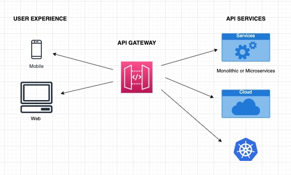
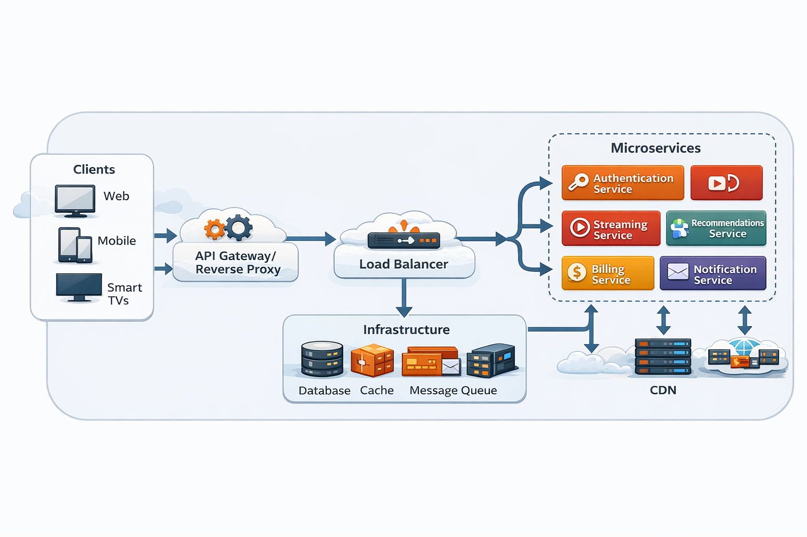
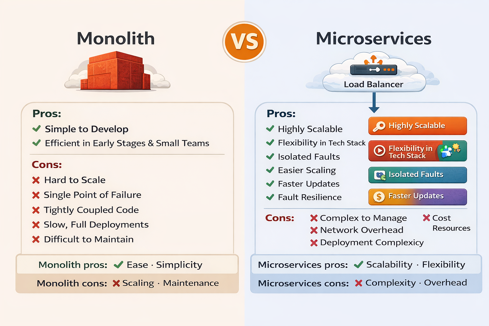
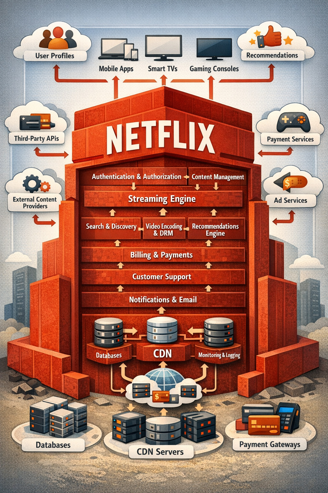
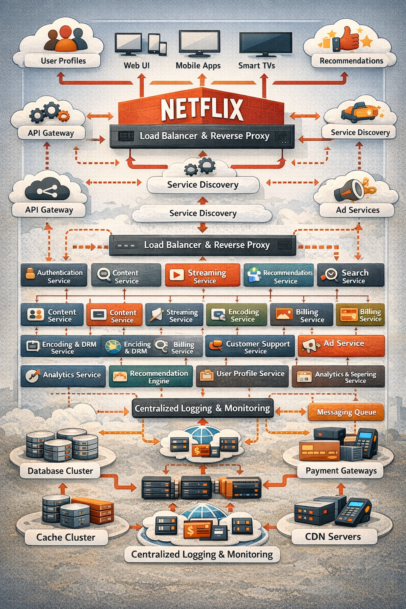

# 📘 System Design Evolution: Monolith → Microservices (Netflix Case Study)

---

# 🧭 Overview

This document explains:
- Monolithic Architecture
- Microservices Architecture
- API Gateway Pattern
- Real-world Netflix Architecture
- Trade-offs, use cases, and decision guidelines

---

# 🧱 1. Monolithic Architecture

<strong>📖 Explanation</strong>

### Definition
A monolith is a **single deployable unit** where all components are tightly coupled.

### Characteristics
- Single codebase
- Single database
- Single deployment

### Pros
- Simple to build
- Easy to test initially
- Low operational overhead

### Cons
- Hard to scale
- Single point of failure
- Slow deployments
- Tight coupling

### Use Cases
- Startups (early stage)
- MVP products
- Small internal tools

---

# 🧱 2. Microservices Architecture

<strong>📖 Explanation</strong>

### Definition
System divided into **independent services**, each responsible for a business capability.

### Characteristics
- Independent deployments
- Polyglot tech stack
- Decentralized data

### Pros
- Highly scalable
- Fault isolation
- Faster deployments
- Team autonomy

### Cons
- Complex system design
- Network overhead
- Distributed failures
- Observability challenges

### Use Cases
- Large-scale platforms (Netflix, Uber)
- High traffic systems
- Systems requiring independent scaling

---

# ⚖️ 3. Monolith vs Microservices

---

# 🌐 4. API Gateway Pattern

<strong>📖 Explanation</strong>

### Role
Acts as a **single entry point** for all clients.

### Responsibilities
- Authentication
- Routing
- Rate limiting
- Aggregation

### Example
Client → API Gateway → Services

### Tools
- Kong
- AWS API Gateway
- NGINX

---

# 🎬 5. Netflix Monolithic Architecture

<strong>📖 Explanation</strong>

### Characteristics
- Centralized streaming engine
- Shared database
- Tight coupling

### Problems Faced
- Scaling bottlenecks
- Deployment risks
- Limited agility

---

# 🎬 6. Netflix Microservices Architecture

<strong>📖 Explanation</strong>

### Key Components

- API Gateway
- Load Balancer
- Service Discovery
- Independent services:
  - Authentication
  - Streaming
  - Recommendation
  - Billing
  - Search

### Infrastructure
- Cache (Redis)
- DB clusters
- Message queues (Kafka)
- CDN

### Benefits
- Independent scaling
- Fault isolation
- Global availability

---

# 🔄 7. System Flow (End-to-End)

<strong>Click to expand</strong>

1. Client sends request  
2. API Gateway authenticates  
3. Load balancer routes  
4. Service discovery finds service  
5. Microservice processes request  
6. Data fetched from DB/cache  
7. Response returned  

---

# 🧠 8. When to Choose What?

| Scenario | Choose |
|---------|--------|
| MVP / Startup | Monolith |
| Rapid scaling | Microservices |
| High availability | Microservices |
| Low complexity | Monolith |

---

# 🧩 9. Real-World Use Case Mapping

| System | Architecture |
|------|-------------|
| Banking Core | CP + Monolith/Micro |
| Netflix | Microservices |
| Uber | Microservices |
| Small SaaS | Monolith |

---

# 📌 Final Insight

> Start with a monolith, evolve into microservices when scale demands it.

