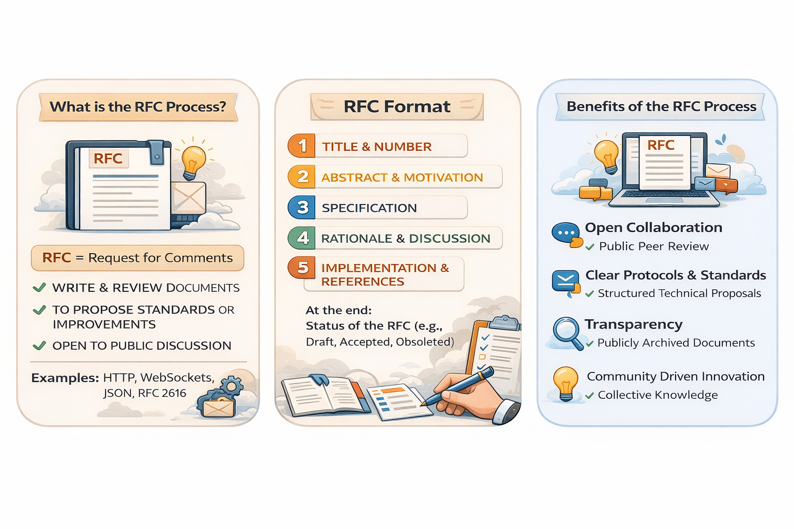

# 📘 RFC (Request for Comments) – Complete Guide

---

## 🖼️ RFC Overview

---

<strong>🔹 What is an RFC?</strong>

### Definition
RFC (Request for Comments) is a **formal document used to propose, discuss, and standardize ideas or changes**.

### Key Characteristics
- Open for discussion and feedback
- Iterative refinement
- Used before implementation

### Purpose
> Ensure **alignment, correctness, and consensus** before building systems

---

### Real Examples
- HTTP → RFC 2616
- TCP/IP → RFC 793
- JSON → RFC 8259

---

<strong>🔹 RFC Structure</strong>

### Standard Format

1. Title & Number  
2. Abstract & Motivation  
3. Specification  
4. Rationale & Discussion  
5. Implementation & References  
6. Status  

---

### Explanation

#### 1. Title & Number
- Unique identifier
- Example: RFC-001 API Gateway Design

#### 2. Abstract & Motivation
- Why this RFC exists
- Problem statement

#### 3. Specification
- Detailed technical design
- APIs, protocols, architecture

#### 4. Rationale & Discussion
- Why this approach?
- Trade-offs
- Alternatives

#### 5. Implementation & References
- How to build it
- Links, standards

#### 6. Status
- Draft / Review / Accepted / Rejected

---

<strong>🔹 Benefits of RFC</strong>

- 👥 Open collaboration
- 📄 Clear documentation
- 🔍 Transparency
- 🧠 Collective intelligence
- 📚 Standardization

---

# 🧩 Real RFC Examples

---

<strong>📌 RFC-001: API Gateway vs Direct Service Access</strong>

### Title
RFC-001: API Gateway Adoption

### Abstract
Introduce API Gateway to manage external traffic to microservices.

---

### Motivation
- Too many direct service calls
- No centralized auth or rate limiting

---

### Specification

- Use **Kong / AWS API Gateway**
- Route traffic through gateway
- Add:
  - Authentication
  - Rate limiting
  - Logging

---

### Rationale

**Chosen because:**
- Centralized control
- Security

**Alternatives:**
- Direct service exposure
- Kubernetes Ingress

---

### Consequences

**Pros:**
- Better security
- Observability

**Cons:**
- Extra latency
- Cost overhead

---

### Status
Accepted

---

<strong>📌 RFC-002: REST vs gRPC Communication</strong>

### Abstract
Decide communication protocol for internal services.

### Options
- REST (HTTP/JSON)
- gRPC (HTTP/2, Protobuf)

### Decision
Use **gRPC for internal communication**

### Rationale

**Pros:**
- Faster (binary protocol)
- Strong typing

**Cons:**
- Harder debugging
- Learning curve

### Status
Accepted

---

<strong>📌 RFC-003: Monolith vs Microservices</strong>

### Abstract
System scaling challenges in monolith architecture.

### Decision
Move to **Microservices architecture**

### Rationale

**Pros:**
- Independent scaling
- Faster deployments

**Cons:**
- Distributed complexity
- Network failures

### Status
Accepted

---

# 🔄 RFC Lifecycle

<strong>Click to expand</strong>

1. Draft → Created  
2. Review → Feedback collected  
3. Discussion → Debate & refine  
4. Decision → Accept / Reject  
5. Implementation → Build system  
6. Archive → Stored for history  

---

# 🧠 ADR vs RFC (Important)

<strong>Click to expand</strong>

| Aspect | RFC | ADR |
|------|-----|-----|
| Purpose | Proposal & discussion | Final decision record |
| Timing | Before decision | After decision |
| Nature | Collaborative | Documentation |
| Output | Debate | Record |

---

### Flow

RFC → Discussion → Decision → ADR

---

# 📌 Final Insight

> RFCs help you **think before building**  
> ADRs help you **remember why you built it**

