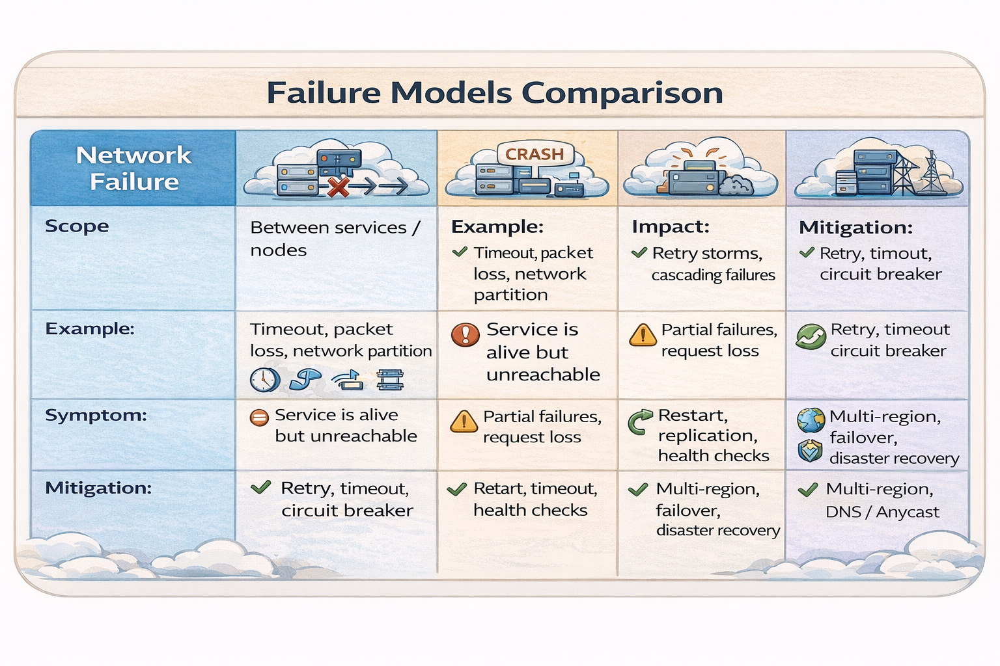
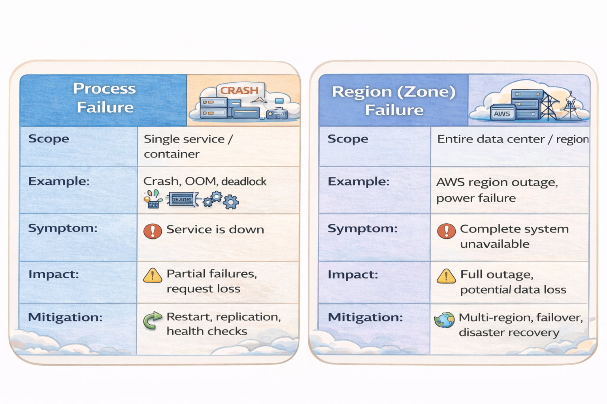

# 📘 Failure Models in Distributed Systems

---

## 🖼️ Failure Models Comparison

---

🔹 Network Failure (Click to expand)

### Definition
Failure in communication between services while services are alive.

### Scope
- Service-to-service communication
- Cross-node / cross-region

### Examples
- Packet loss
- Timeout
- Network partition

### Symptoms
- High latency
- Retry storms
- Partial failures

### Impact
- Cascading failures
- Resource exhaustion

### Mitigation
- Exponential backoff retries
- Circuit breakers
- Timeouts
- Bulkheads

---

🔹 Process Failure (Click to expand)

### Definition
Failure of a single service instance or container.

### Examples
- Crash
- OOM
- Deadlock

### Symptoms
- Service down
- Health checks failing

### Impact
- Partial outage
- Request loss

### Mitigation
- Restart policies
- Replication
- Health checks
- Auto scaling

---

🔹 Region Failure (Click to expand)

### Definition
Failure of an entire region or data center.

### Examples
- AWS outage
- Power failure

### Symptoms
- Complete system unavailable

### Impact
- Full outage
- Data loss risk

### Mitigation
- Multi-region deployment
- Failover strategies
- Disaster recovery
- DNS routing

---

## 🔄 Failure Interaction

Click to expand

- Network issue → retries increase  
- Retries → load spike  
- Load spike → process crashes  
- Multiple crashes → regional outage  

---

## ⚖️ CAP Mapping

Click to expand

- Network Failure → Partition  
- Process Failure → Availability  
- Region Failure → Availability + Partition  

---

## 📌 Final Thought

> Distributed systems fail not if, but when.

